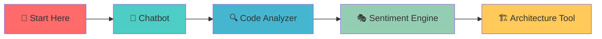

# 🦀 AI-Powered Rust Masterclass

> **Production-grade AI applications built with Rust's safety and performance**

<div align="center">


**[🚀 Quick Start](#-quick-start) • [📚 Projects](#-projects) • [🏗️ Architecture](#️-engineering-philosophy) • [🤝 Contributing](#-contributing)**

</div>

---

## ✨ What Makes This Special?

This isn't just another code repository—it's a **curated showcase** of how Rust and AI can work together to create robust, production-ready applications. Each project solve real-world problems.

```rust
// Zero compromises. Production-ready from day one.
fn main() {
    println!("Building the future with Rust + AI 🚀");
}
```

## 🎯 Projects

### 💬 Command-Line Chatbot
*Perfect entry point for AI-driven Rust applications*

```bash
┌─ 🤖 Interactive AI Chat Session
│  ├─ 🔐 Secure API management
│  ├─ 📝 Conversation history
│  └─ 🐳 Docker containerized
```

**What you'll learn:** Secure API interaction, modular architecture, containerization

---

### 🔍 AI Code Analyzer
*Your AI pair programmer for better Rust code*

```bash
┌─ 🧠 Semantic Code Analysis
│  ├─ 📁 Single files or entire projects  
│  ├─ 💡 Intelligent suggestions
│  └─ 🎯 Anti-pattern detection
```

**What you'll learn:** AST manipulation with `syn`, developer tooling, semantic analysis

---

### 🎭 Explainable Sentiment Engine
*AI that shows its work - built for trust and auditability*

```bash
┌─ 🧭 Explainable AI (XAI)
│  ├─ 🤔 Chain-of-thought reasoning
│  ├─ ⚙️ JSON-configurable rules
│  └─ 📊 Professional logging
```

**What you'll learn:** Explainable AI patterns, configuration-driven design, observability

---

### 🏗️ Architecture Illustrator
*Automatically visualize your codebase architecture*

```bash
┌─ 🎨 Automated Architecture Discovery
│  ├─ 📊 Component diagrams
│  ├─ 🔄 Sequence diagrams  
│  └─ 📋 MermaidJS output
```

**What you'll learn:** Codebase analysis, prompt engineering, architectural visualization

## 🚀 Quick Start

```bash
# Clone the repository
git clone git@github.com:dfbustosus/ai-rs.git
cd ai-rs

# Pick your adventure
cd chatbot-rs        # Start here for beginners
cd rust-analyzer-ai  # For AST manipulation
cd sentiment-engine-rs # For explainable AI
cd rust-architect-ai # For architecture visualization

# Follow individual README instructions
cargo build --release
```

## 🏗️ Engineering Philosophy

<table>
<tr>
<td align="center">🎯<br><b>Zero Technical Debt</b><br>Production-ready code, no shortcuts</td>
<td align="center">🔧<br><b>Strict Modularity</b><br>Single responsibility, easy to extend</td>
<td align="center">🛡️<br><b>Security First</b><br>Secure secret management, resilient design</td>
</tr>
<tr>
<td align="center">📦<br><b>Best-in-Class Deps</b><br>Curated, battle-tested crates</td>
<td align="center">🧪<br><b>Testable by Design</b><br>Every component fully testable</td>
<td align="center">📚<br><b>Documentation First</b><br>Self-documenting, clear architecture</td>
</tr>
</table>

## 🛠️ Tech Stack

<div align="center">

| Category | Technologies |
|----------|-------------|
| **Language** |  |
| **AI/ML** |  |
| **CLI** |  |
| **Async** |  |
| **Serialization** |  |
| **Containerization** |  |

</div>

## 📈 Learning Path



**Beginner** → **Intermediate** → **Advanced** → **Expert**

## 🤝 Contributing

We welcome contributions! Each project has its own contribution guidelines in their respective directories.

```bash
# Found a bug or have an idea?
git checkout -b feature/amazing-improvement
# Make your changes
git commit -m "✨ Add amazing improvement"
git push origin feature/amazing-improvement
# Open a PR!
```

## 📄 License

This project is licensed under the MIT License - see the [LICENSE](LICENSE) file for details.

## ⭐ Show Your Support

If this repository helped you learn or build something awesome, give it a star! ⭐

<div align="center">

**Built with ❤️ by developers, for developers**

[🐛 Report Bug](../../issues) • [💡 Request Feature](../../issues) • [💬 Discussions](../../discussions)

</div>

---

<div align="center">
<sub><strong>Ready to master AI-powered Rust development? Start with the chatbot and work your way up! 🚀</strong></sub>
</div>